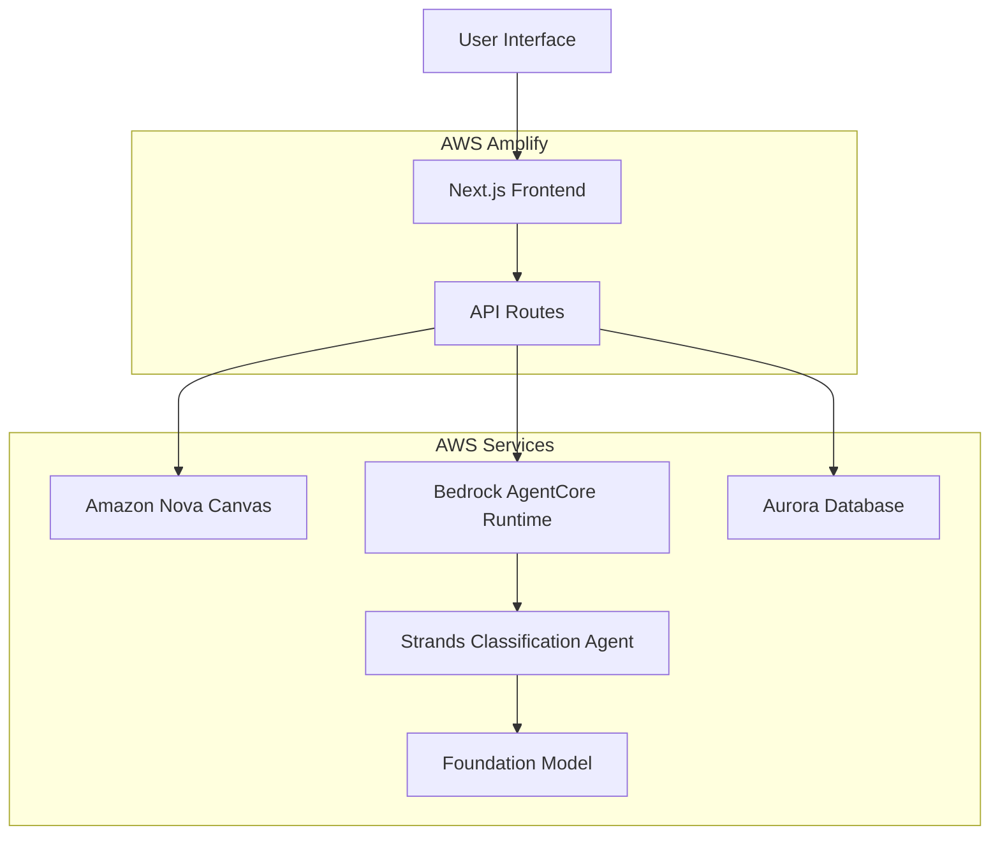

# Design Document

## Overview

The Pet Image AI application is a single-page web application built with Next.js that provides two core functionalities: AI-powered pet image generation using Amazon Nova Canvas on Bedrock and intelligent image classification with data persistence. The application uses a modern React frontend with TypeScript, integrates with Amazon Bedrock for both image generation and classification, leverages Amazon Bedrock AgentCore Runtime to deploy a Strands Agents Framework-based classification agent, and stores classification results in an Aurora database.

The architecture follows a clean separation between the frontend interface, API routes for Bedrock integration, database operations, and the AI agent deployment on AWS infrastructure. The application is designed for local development and deployed on AWS Amplify with native AWS service integration and simplified IAM role management.

## Architecture

### High-Level Architecture



### Component Architecture

**Frontend Layer:**

- Next.js 15.5.6 with React and TypeScript
- Single page application with no authentication
- Responsive design using Tailwind CSS
- State management for image generation and classification workflows

**API Layer:**

- Next.js API routes for backend functionality
- `/api/generate-image` - Integrates with Amazon Nova Canvas on Bedrock
- `/api/classify-image` - Proxies requests to Bedrock Agent and stores results in Aurora
- AWS SDK integration for Bedrock services and RDS Aurora
- Error handling and response formatting

**Database Layer:**

- Amazon Aurora PostgreSQL for storing classification results
- User name, classification results, confidence scores, and timestamps
- Connection pooling and error handling for database operations

**AI Agent Layer:**

- Strands Agents Framework deployed on Bedrock AgentCore Runtime
- Image classification agent with computer vision capabilities
- Structured response format with classification and confidence scores

## Components and Interfaces

### Frontend Components

**MainInterface Component:**

```typescript
interface MainInterfaceProps {
  onImageGenerated: (imageUrl: string) => void;
  onClassificationResult: (result: ClassificationResult) => void;
}
```

**ImageGenerator Component:**

```typescript
interface ImageGeneratorProps {
  onImageGenerated: (imageUrl: string) => void;
  isLoading: boolean;
}

interface GenerateImageRequest {
  petType: 'cat' | 'dog';
}
```

**ImageClassifier Component:**

```typescript
interface ImageClassifierProps {
  imageUrl: string;
  onClassificationResult: (result: ClassificationResult) => void;
  isLoading: boolean;
}

interface ClassificationResult {
  classification: 'cat' | 'dog';
  confidence: number;
  processingTime: number;
  userName: string;
  timestamp: string;
}
```

### API Interfaces

**Image Generation API:**

```typescript
// POST /api/generate-image
interface GenerateImageRequest {
  petType: 'cat' | 'dog';
}

interface GenerateImageResponse {
  success: boolean;
  imageUrl?: string;
  error?: string;
}
```

**Image Classification API:**

```typescript
// POST /api/classify-image
interface ClassifyImageRequest {
  imageUrl: string;
  userName: string;
}

interface ClassifyImageResponse {
  success: boolean;
  result?: ClassificationResult;
  error?: string;
}
```

### Bedrock Agent Interface

**Agent Input/Output:**

```typescript
interface AgentRequest {
  imageData: string; // Base64 encoded image
  task: 'classify_pet';
}

interface AgentResponse {
  classification: 'cat' | 'dog';
  confidence: number;
  reasoning: string;
  processingTime: number;
}
```

## Data Models

### Application State

```typescript
interface AppState {
  currentImage: string | null;
  isGenerating: boolean;
  isClassifying: boolean;
  classificationResult: ClassificationResult | null;
  userName: string;
  error: string | null;
}
```

### Database Models

```typescript
interface ClassificationRecord {
  id: string;
  userName: string;
  imageUrl: string;
  classification: 'cat' | 'dog';
  confidence: number;
  processingTime: number;
  timestamp: Date;
  createdAt: Date;
  updatedAt: Date;
}
```

### Configuration Models

```typescript
interface NovaCanvasConfig {
  modelId: 'amazon.nova-canvas-v1:0';
  region: string;
  imageConfig: {
    quality: 'standard' | 'premium';
    width: number;
    height: number;
    numberOfImages: number;
  };
}

interface BedrockAgentConfig {
  region: string;
  agentId: string;
  agentAliasId: string;
  credentials: {
    accessKeyId: string;
    secretAccessKey: string;
  };
}

interface DatabaseConfig {
  host: string;
  port: number;
  database: string;
  username: string;
  password: string;
  ssl: boolean;
}
```

## Error Handling

### Frontend Error Handling

**User-Friendly Error Messages:**

- Image generation failures: "Unable to generate image. Please try again."
- Classification failures: "Unable to classify image. Please check your connection."
- Network errors: "Connection error. Please check your internet connection."

**Error Recovery:**

- Retry mechanisms for transient failures
- Graceful degradation when services are unavailable
- Clear error state management and user feedback

### API Error Handling

**Structured Error Responses:**

```typescript
interface ErrorResponse {
  success: false;
  error: string;
  code: string;
  details?: any;
}
```

**Error Categories:**

- `NOVA_CANVAS_FAILED`: Amazon Nova Canvas generation errors
- `CLASSIFICATION_FAILED`: Bedrock Agent errors
- `DATABASE_ERROR`: Aurora database connection or query errors
- `AWS_CREDENTIALS_INVALID`: AWS authentication errors
- `INVALID_REQUEST`: Malformed request data
- `SERVICE_UNAVAILABLE`: AWS service downtime

### Agent Error Handling

**Bedrock Agent Errors:**

- Agent deployment failures
- Model inference errors
- Timeout handling for long-running classifications
- Fallback responses when agent is unavailable

## Testing Strategy

### Unit Testing

**Frontend Components:**

- Component rendering and user interactions
- State management and prop handling
- Error boundary functionality
- API integration mocking

**API Routes:**

- Request/response validation
- Error handling scenarios
- External service integration mocking
- Authentication and authorization (when added)

### Integration Testing

**End-to-End Workflows:**

- Complete image generation and classification flow
- Error scenarios and recovery
- Performance under load
- Cross-browser compatibility

**API Integration:**

- Amazon Nova Canvas integration via AWS SDK
- Bedrock Agent communication
- AWS credential validation
- Error propagation and handling
- Response time validation

### Agent Testing

**Strands Agent Validation:**

- Classification accuracy testing
- Response time benchmarking
- Error handling verification
- Deployment validation on Bedrock AgentCore

## Deployment Architecture

### Local Development

**Development Stack:**

- Next.js development server on localhost:3000
- Environment variables for AWS credentials and Bedrock configuration
- Hot reloading for efficient development
- Local testing of both Nova Canvas and Bedrock Agent integration

### AWS Amplify Deployment

**Production Stack:**

- AWS Amplify hosting with serverless functions
- Native AWS service integration with IAM roles
- Environment variables configured in Amplify console
- Automatic deployments from Git repository
- Built-in AWS SDK optimization and credential management

**Required Environment Variables:**

```bash
# AWS Configuration
AWS_REGION=us-east-1

# For local development only (Amplify uses IAM roles in production)
AWS_ACCESS_KEY_ID=your_access_key
AWS_SECRET_ACCESS_KEY=your_secret_key

# Bedrock Agent for Classification
BEDROCK_AGENT_ID=your_agent_id
BEDROCK_AGENT_ALIAS_ID=your_alias_id

# Nova Canvas Model Configuration
NOVA_CANVAS_MODEL_ID=amazon.nova-canvas-v1:0

# Aurora Database Configuration
DATABASE_HOST=your-aurora-cluster.cluster-xyz.us-east-1.rds.amazonaws.com
DATABASE_PORT=5432
DATABASE_NAME=pet_image_ai
DATABASE_USERNAME=your_db_user
DATABASE_PASSWORD=your_db_password
```

### AWS Infrastructure

**Amplify Hosting:**

- Next.js application deployed on AWS Amplify
- Automatic CI/CD pipeline from Git repository
- Built-in IAM role management for AWS service access
- Environment variable management through Amplify console

**Bedrock AgentCore Deployment:**

- Strands Agents Framework packaged for Bedrock Runtime
- Agent deployed with appropriate IAM roles and permissions
- Alias management for version control
- Monitoring and logging configuration

**Security Considerations:**

- IAM roles with least privilege access (managed by Amplify)
- No API key management needed for AWS services in production
- CORS configuration for frontend access
- Rate limiting and usage monitoring through AWS CloudWatch

### Performance Considerations

**Frontend Optimization:**

- Image lazy loading and caching
- Optimized bundle size with code splitting
- Progressive loading states
- Responsive image handling

**Backend Optimization:**

- API response caching where appropriate
- Connection pooling for external services
- Timeout configuration for long-running operations
- Error retry with exponential backoff

**Agent Optimization:**

- Efficient image preprocessing
- Model selection for speed vs accuracy balance
- Batch processing capabilities for future scaling
- Memory management for large images
